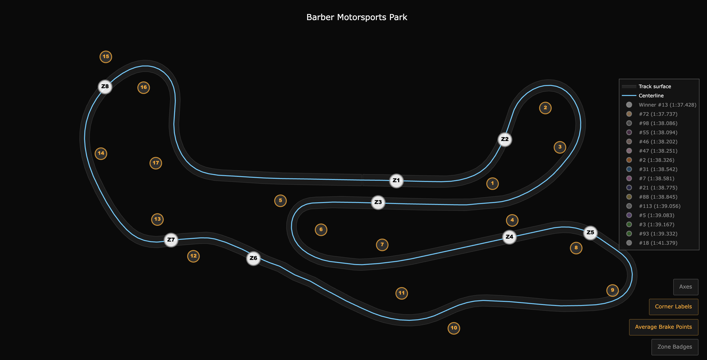
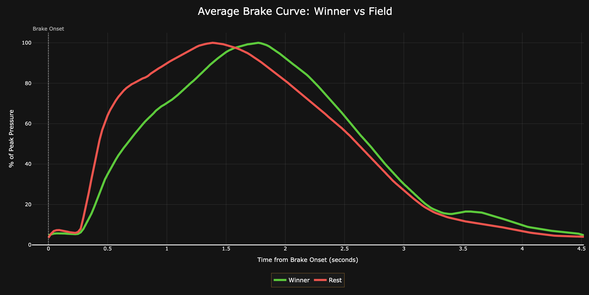

# Brake Point Drift Detector

**Hack the Track 2025 - Driver Training & Insights Category**

Brake Point Drift Detector analyzes GR Cup telemetry to measure driver consistency and pinpoint where to focus practice time. Using GPS coordinates and brake pressure data, it visualizes brake point scatter across corners, revealing systematic technique problems.

> **Consistency separates fast drivers from champions—but how do you measure it?**


## Demo

[](https://youtu.be/-Oz4Zg9sSGc)

*Click above to watch the interactive dashboard demo on YouTube*

- **[Try the tool here](https://edulizanay.github.io/14.toyota-hackathon/)**
- **Official Dataset**: `barber-motorsports-park.zip` from [trddev.com/hackathon-2025](https://trddev.com/hackathon-2025)

## What we learned

- **Winners brake earlier and softer**: Podium finishers initiate braking 26m earlier on average and use 23% less brake pressure (7.1 bar vs. 9.2 bar), giving more time to settle the car before turn-in.

- **Smooth beats hard**: Podium drivers build brake pressure gradually (24% smoother) rather than stabbing it hard, keeping the car balanced while slower drivers upset the chassis with jerky inputs. This can be spotted in the brake pressure evolution for said zones:




> 📊 Detailed analysis can be found in [analytics/](analytics/).

## Quick Start

### Prerequisites
- Python 3.13+ (tested on 3.13)
- Virtual environment recommended

### Installation

```bash
# Navigate to deliverables directory
cd deliverables

# Create virtual environment
python3 -m venv venv

# Activate virtual environment
source venv/bin/activate  # On Windows: venv\Scripts\activate

# Install dependencies
pip install -r requirements.txt
```

### Usage

```bash
# Run the analysis pipeline (from deliverables/ directory)
python main.py

# Output: dashboard.html (open in any web browser)
```

The pipeline processes telemetry data and generates an interactive dashboard showing:
- Track map with brake points plotted by GPS coordinates
- Zone-by-zone dispersion analysis (in meters)
- Driver comparison against fastest lap reference
- Toggle between individual brake points and average centroids

### Input Data

The tool uses:
- **GR Cup Telemetry** (Barber Motorsports Park) from `barber-motorsports-park.zip` - brake pressure, GPS coordinates, speed, lap numbers
- **USAC Timing Data** - lap times and race results

Data files are located in `deliverables/data/input/`:
- `telemetry.csv` - Raw GR Cup telemetry
- `usac.csv` - Race timing data
- `corner_definitions.json` - Brake zone boundaries defined by clusters of breaks
- `corner_labels.json` - Corner positioning for enhanced aesthetics

## How It Works

### 1. Track Centerline Generation

The track centerline is computed from GPS telemetry using a multi-stage smoothing pipeline:

1. **Raw GPS Extraction**: Select one vehicle's most complete lap (highest GPS sample count)
2. **Distance-based Resampling**: Convert to uniform 2-meter spacing, removing GPS spikes (>10m jumps) and duplicates
3. **Periodic Smoothing**: Apply Savitzky-Golay filter (31-point window, 3rd-order polynomial) with periodic wrapping to eliminate start/finish kinks
4. **Caching**: Centerline saved to `data/output/track_centerline.csv` for reuse (use `--force` to regenerate)

**Outcome**: A stable, smooth centerline.

### 2. Brake Onset Detection

Brake events are detected using rising-edge logic:

1. **Threshold Calculation**: Remove bottom 5% of all positive brake pressures to filter noise
2. **Pressure Selection**: Use `max(pbrake_f, pbrake_r)` - whichever brake is pressed harder
3. **Brake Type Recording**: Tag each event as "front" or "rear" based on which pressure led
4. **Rising Edge Detection**: Detect transition from `pressure < threshold` → `pressure >= threshold` (brake onset)
5. **GPS Association**: Record GPS coordinates (x, y meters) at the moment of brake onset

**Outcome**: Each brake event has a GPS coordinate, timestamp, lap number, vehicle number, and brake type.

### 3. Zone Detection & Dispersion

1. **Zone Discovery**: Identify brake event clusters from the data rather than using predefined corners—zones reflect where drivers actually brake, not where corners are marked
2. **Zone-Focused Analysis**: Calculate dispersion (standard deviation) only within identified zones
3. **Consistency Ranking**: Lower dispersion = more consistent braking technique

### 4. Interactive Dashboard

The dashboard provides:
- **Track visualization**: Overhead track map with brake points color-coded by driver
- **Driver comparison**: Compare any driver against the fastest lap reference
- **Dual modes**: Toggle between individual brake points (scatter) and average brake points (centroids)


### Lookng at the Future

By giving drivers precise, data-driven feedback on their brake point consistency, we enable them to refine their training with surgical precision—transforming gut feeling into measurable improvement and turning good drivers into champions.

## Project Structure

```
deliverables/
├── main.py                    # Entry point and pipeline orchestrator
├── dashboard.html             # Generated interactive dashboard
├── requirements.txt           # Python dependencies
├── data/
│   ├── input/                 # Source datasets (telemetry, USAC, zones)
│   └── output/                # Generated CSVs (brake_events, centroids, etc.)
└── src/
    ├── data_processing.py     # Brake detection, zone assignment, dispersion
    └── visuals/
        ├── geometry.py        # GPS smoothing and coordinate math
        ├── track_outline.py   # Centerline computation
        └── dashboards.py      # Plotly dashboard generation
```

## License

This project was created for the Hack the Track 2025 hackathon by Toyota Gazoo Racing. All telemetry data is provided by Toyota Racing Development and is subject to their licensing terms.

## Authors

Built by Eduardo Lizana for Hack the Track 2025.

## Acknowledgments

- Toyota Gazoo Racing for providing GR Cup telemetry datasets
- USAC for race timing data
- Barber Motorsports Park for the incredible racing venue
